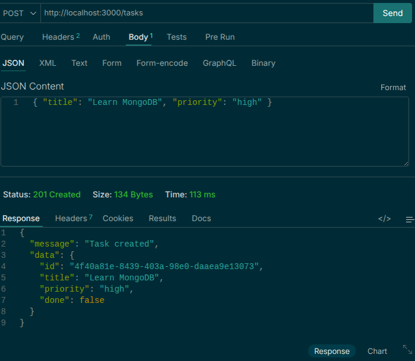
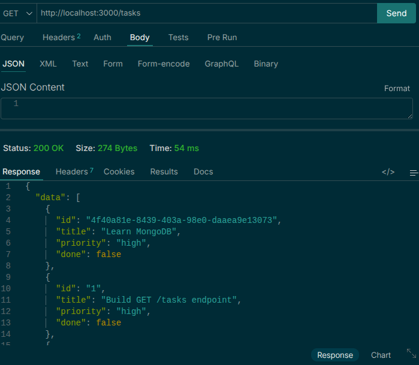
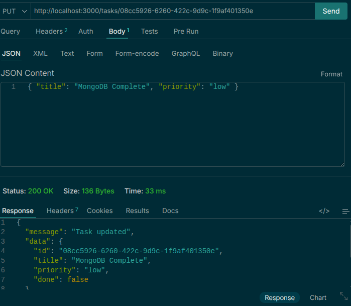

# decodelabs-project-2-backend-api

Backend API for the Decodelabs project.

## Features

- REST API
- Environment-based configuration
- Input validation
- Error handling
- Logging and monitoring ready

## Prerequisites

- Node.js 18+
- npm or yarn
- A supported database service

## Installation

```bash
git clone <repository-url>
cd decodelabs-project-2-backend-api
npm install
```

## Configuration

Create a `.env` file in the project root:

```env
PORT=3000
NODE_ENV=development
DATABASE_URL=your_database_url
JWT_SECRET=your_jwt_secret
```

## Development

```bash
npm run dev
```

## Production

```bash
npm start
```

## Testing

```bash
npm test
```

## Project Structure

```text
.
├── src/
├── tests/
├── .env
├── package.json
└── README.md
```



